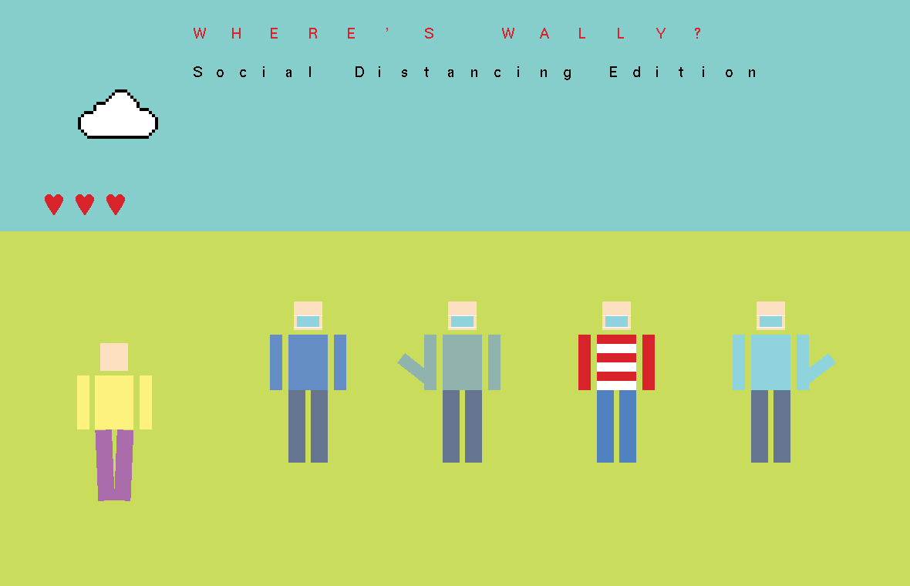

# Where's Wally? Social Distancing Edition

A small point-and-click game drawn with legacy OpenGL and FreeGLUT: find Wally (red and white
stripes) among the masked, socially distanced crowd before your three lives run out. A wrong
click costs a heart, finding Wally draws a box around him, and a right click starts a new round.
The cloud drifts across the sky and the person on the left walks away from the crowd.

Made with [@andrardg](https://github.com/andrardg) for the *Computer Graphics* (OpenGL) course at
the University of Bucharest.




## Build and run

```bash
sudo apt install freeglut3-dev      # Linux; on Windows use the freeglut binaries
g++ main.cpp -o wheres-wally -lglut -lGL -lGLU
./wheres-wally
```
